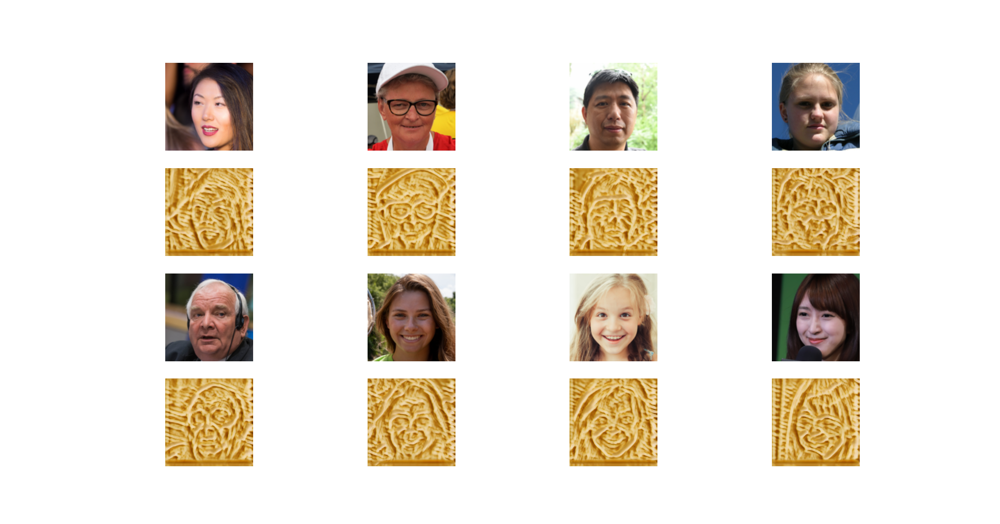

# PastaGAN

Style transfer convolutional neural network trained on FFHQ dataset and pasta images. Network architecture based on [AnimeGAN](https://github.com/TachibanaYoshino/AnimeGAN).

## Generated examples

